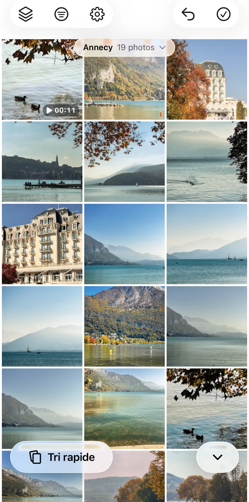
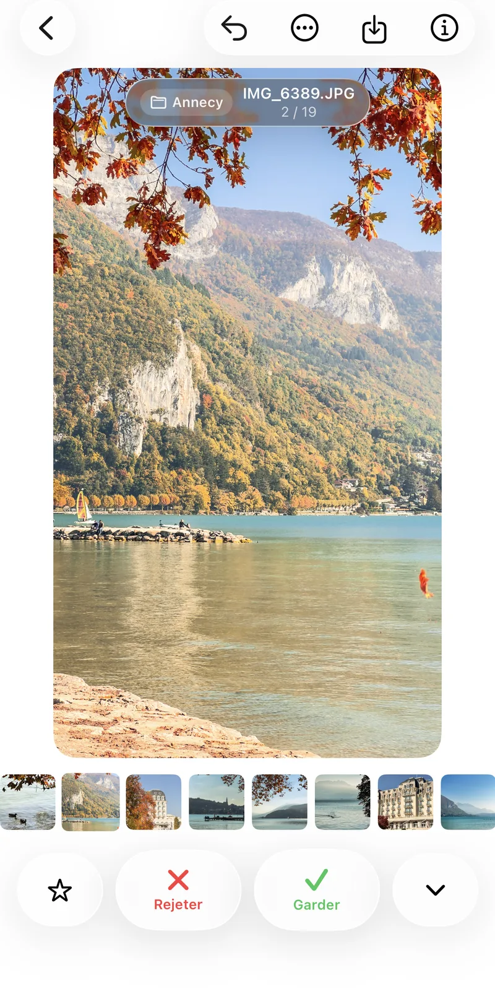
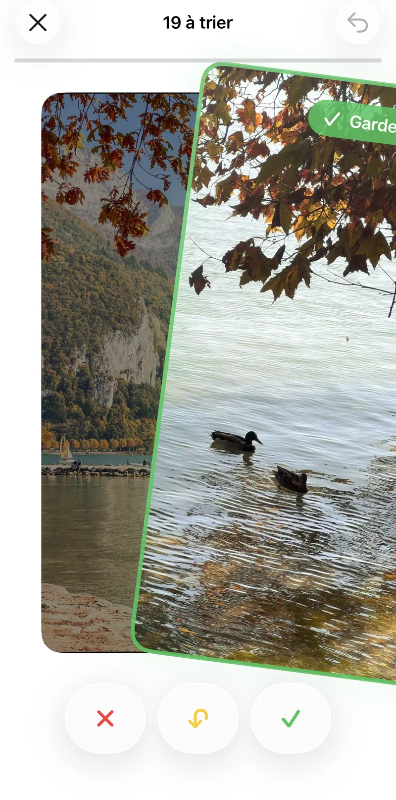
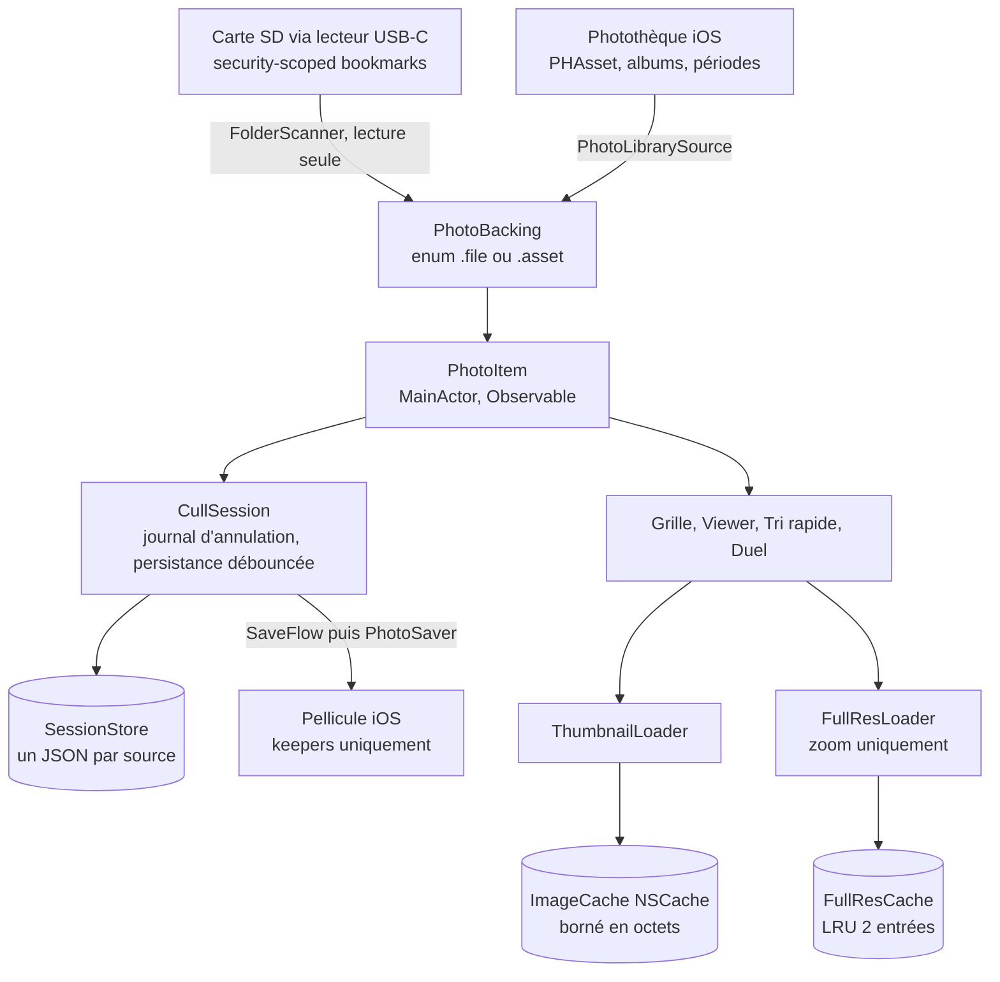
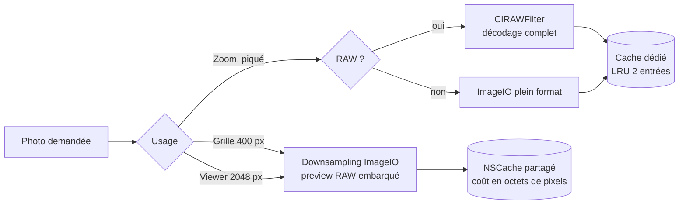
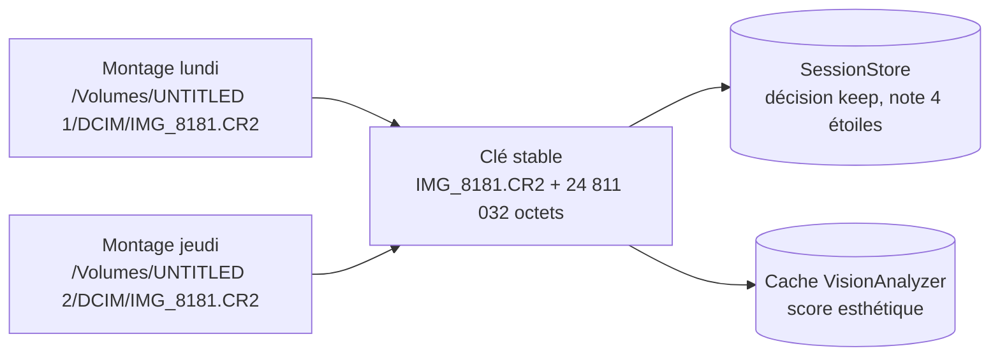

# Peliculle

**Trier des RAW de 45 Mpx directement depuis la carte SD, avec le ressenti de Photos.app** — sans import, sans abonnement : seuls les keepers rejoignent la pellicule, la carte reste en lecture seule stricte.

[](https://swift.org)
[](https://developer.apple.com/xcode/swiftui/)
[]()
[]()

**[→ Landing (peliculle.netlify.app)](https://peliculle.netlify.app/)** · **[→ Étude de cas complète sur mon portfolio](https://owenlebec.fr/projects/peliculle)**

> App pas encore publiée sur l'App Store — en développement actif.

---

<table>
<tr>
<td></td>
<td></td>
<td></td>
</tr>
</table>

---

## Contexte

Quand on branche une carte SD d'appareil photo sur un iPhone USB-C, iOS n'offre aucun vrai workflow de tri : le dialogue d'import natif n'a pas de plein écran navigable, l'app Fichiers gère mal les RAW, et les alternatives (Lightroom, Raw Power) imposent un import préalable ou un abonnement. Peliculle comble ce manque : un viewer plein écran fluide qui travaille directement sur la carte, un tri par gestes (garder / rejeter), et seuls les keepers sont enregistrés dans la pellicule — la carte reste intacte, en lecture seule stricte.

## Fonctionnalités clés

- Import zéro : lecture directe depuis une carte SD via `security-scoped bookmarks`, ou depuis la photothèque iOS (PHAsset, albums, périodes)
- Tri par gestes : swipe garder / rejeter / plus tard, avec retour haptique
- Piles de rafales détectées automatiquement (chaînage temporel, `BurstGrouper`)
- Duel A/B en tournoi avec zoom synchronisé sur les deux photos (un seul pincement, la même transformation appliquée aux deux panneaux)
- Score esthétique calculé sur l'appareil (Vision), jamais dans le cloud
- Mode Voyage, lecture des vidéos de la carte (AVFoundation)
- Suppression confirmée des rejets, journal d'annulation où chaque geste ne fait qu'une entrée
- Localisation FR/EN complète (String Catalogs, 318 clés)

## Stack technique

| Techno | Rôle |
|---|---|
| Swift, strict concurrency `complete` | Tout le pipeline (décodage, indexation EXIF, analyse Vision) vérifié par le compilateur : acteurs pour les index partagés, état UI isolé au main actor |
| SwiftUI + Observation, cible iOS 26 | 100 % natif : transition hero grille → viewer (`.navigationTransition(.zoom)`), pagination `TabView`, haptique native |
| ImageIO | Aperçus par downsampling borné (`kCGImageSourceThumbnailMaxPixelSize`) — jamais de décodage pleine résolution au scroll |
| Core Image (`CIRAWFilter`) | Décodage RAW plein format uniquement à la demande (zoom pour vérifier le piqué) |
| PhotoKit | Deuxième famille de sources (photothèque, albums) et écriture des keepers dans la pellicule |
| Vision | Score esthétique sur l'appareil, tâche de fond basse priorité |
| AVFoundation | Vignettes et lecture des clips vidéo de la carte |
| Zéro dépendance tierce | Aucun package SPM — ~11 500 lignes de Swift sur les seuls frameworks Apple |

## Architecture

### Vue d'ensemble

Toute la différence entre les sources tient dans l'enum `PhotoBacking` : le reste de l'app (grille, viewer, tri rapide, filtres, Mode Voyage) manipule des `PhotoItem` sans savoir s'ils viennent d'une carte ou de la photothèque. Une session peut même combiner plusieurs sources, chacune avec sa propre persistance.



### Pipeline d'images à trois niveaux

Dimensionné pour la RAM d'un iPhone : aperçus ~400 px pour la grille et ~2048 px pour le viewer via downsampling ImageIO, pleine résolution (`CIRAWFilter`) seulement au zoom. Le cache d'aperçus est un `NSCache` borné en octets (un huitième de la RAM physique, plafonné à 300 Mo) ; la pleine résolution a son cache dédié de 2 entrées — un RAW 45 Mpx décodé pèse ~180 Mo de pixels et aurait évincé toute la grille du cache partagé.



### Identité stable des photos entre deux montages de carte

L'URL absolue d'une carte SD change à chaque branchement ; la persistance (décisions, notes) et le cache d'analyse sont donc keyés par nom + taille de fichier, jamais par URL. Résultat : débrancher la carte, la rebrancher trois jours plus tard, et reprendre le tri exactement là où il s'était arrêté.



D'autres schémas (annulation coopérative des décodages) sont disponibles dans l'[étude de cas complète](https://owenlebec.fr/projects/peliculle).

## Points techniques notables

- **Annulation coopérative des décodages** — chaque chargement hérite de l'annulation du `.task` SwiftUI de sa cellule : au scroll rapide, les décodages des cellules sorties de l'écran s'arrêtent au lieu de tourner jusqu'au bout. Une version antérieure en `Task.detached` laissait des centaines de décodages hors écran voler CPU et batterie aux cellules visibles.
- **Concurrence stricte de bout en bout** — `VisionAnalyzer` et `ExifIndexer` sont des acteurs mutualisés avec déduplication des requêtes en vol, calcul hors acteur en priorité basse, et `allowNetwork: false` pour les passes de fond (analyser 10 000 photos ne doit jamais déclencher 10 000 téléchargements iCloud). À l'inverse, `ImageCache` reste une simple classe `@unchecked Sendable` : `NSCache` est déjà thread-safe, un acteur n'aurait ajouté qu'un saut de contexte par vignette.
- **Le tri comme machine à gestes** — swipe garder / rejeter / plus tard avec retour haptique, piles de rafales détectées par chaînage temporel (`BurstGrouper`, testé unitairement), duel A/B en tournoi avec zoom synchronisé sur les deux photos.

## Cloner et lancer en local

Prérequis : **Xcode récent avec SDK iOS 26**, un appareil ou simulateur iOS 26+.

```bash
git clone https://github.com/OwenLB/peliculle.git
cd peliculle
open Peliculle.xcodeproj
```

Aucun package SPM, aucune variable d'environnement : build et run directement depuis Xcode (⌘R). Les tests unitaires sont dans `PeliculleTests/` (⌘U).

Un site vitrine séparé (Astro, déployé sur [peliculle.netlify.app](https://peliculle.netlify.app/)) vit dans `landing/` :

```bash
cd landing
npm install
npm run dev
```

## Structure du projet

```
Peliculle/
  Models/        → PhotoItem, CullSession, BurstGrouper, filtres, TripMode, ...
  Services/      → ExifIndexer, VisionAnalyzer, ThumbnailLoader, FullResLoader,
                    ImageCache, PhotoSaver, FolderScanner, SessionStore, ...
  Views/         → GridView, FullScreenViewer, QuickCullView, DuelView, ...
PeliculleTests/   → tests unitaires (BurstGrouper, PhotoSort, SessionStore, TripMode, ...)
landing/          → site vitrine Astro séparé (peliculle.netlify.app)
content/          → sources des études de cas (FR/EN) reprises sur owenlebec.fr
```

## Voir le projet en contexte

Cette étude de cas détaille les choix produit, l'architecture complète et le reste des captures d'écran : **[owenlebec.fr/projects/peliculle](https://owenlebec.fr/projects/peliculle)**

Plus de projets sur [owenlebec.fr](https://owenlebec.fr).
