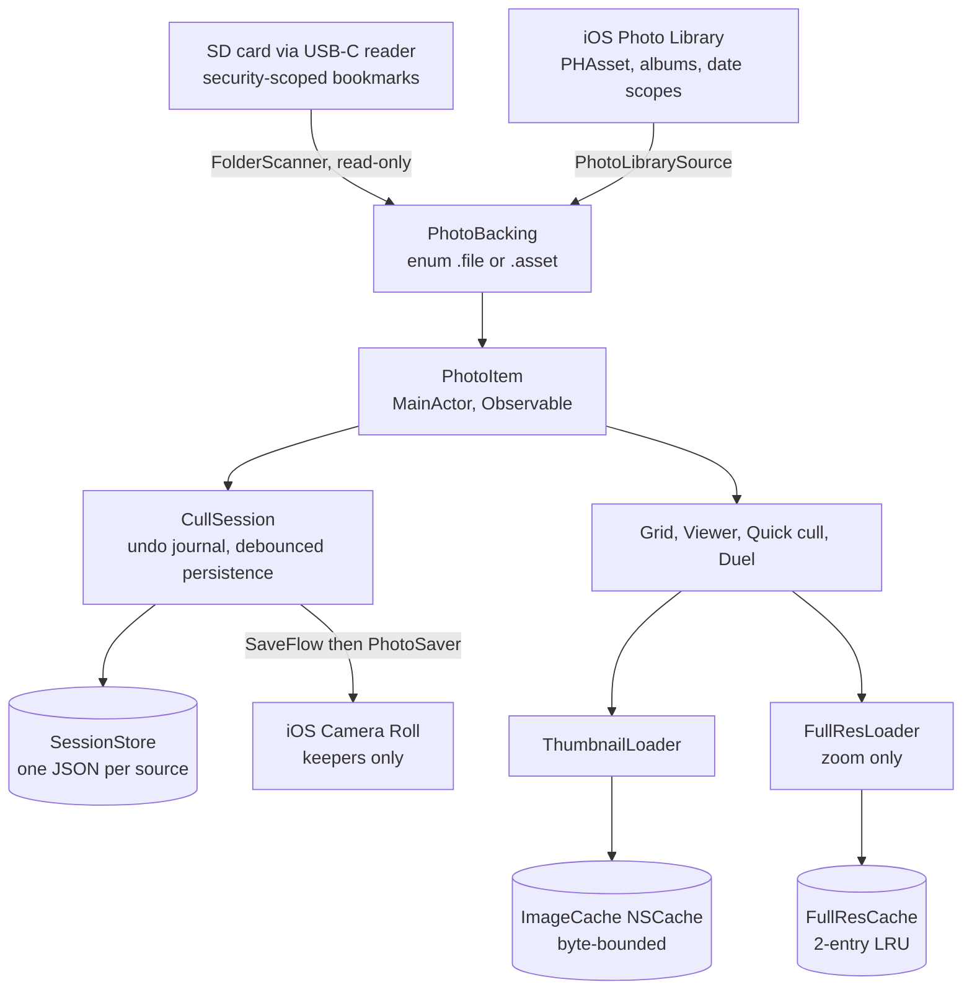
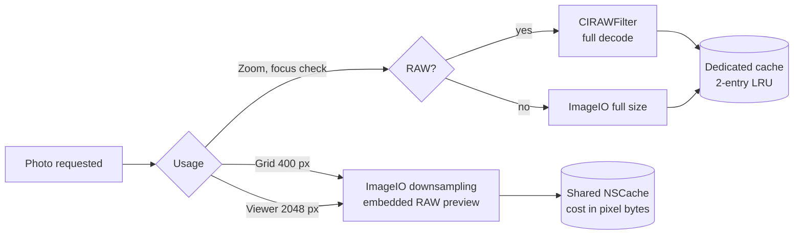
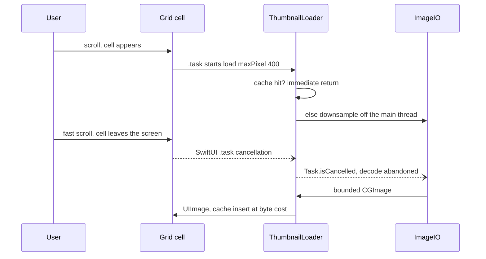
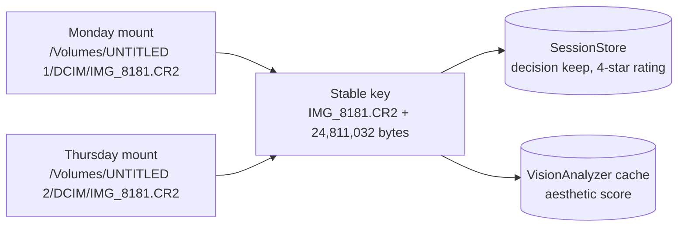

**Context**

When you plug a camera SD card into a USB-C iPhone, iOS offers no real culling workflow: the native import dialog has no navigable full-screen view, the Files app handles RAW poorly, and the alternatives (Lightroom, Raw Power) require a prior import or a subscription. Peliculle fills that gap: a fluid full-screen viewer working directly off the card, gesture-based triage (keep / reject), and only the keepers get saved to the camera roll — the card stays untouched, strictly read-only. There is no previous version: the app is a v1 born from a full PRD, then extended (photo library and albums as sources, videos, Trip Mode, confirmed deletion of rejects).

**Stack & Architecture**

- **Swift, strict concurrency `complete`** — the entire pipeline (decoding, EXIF indexing, Vision analysis) is compiler-checked: actors for shared indexes, UI state isolated to the main actor, every non-trivial `Sendable` justified in a comment.
- **SwiftUI + Observation, iOS 26 target** — 100% native to compete with Photos.app: hero transition from grid to viewer (`.navigationTransition(.zoom)`), `TabView` paging with system inertia, native haptics.
- **ImageIO** — previews generated by bounded downsampling (`kCGImageSourceThumbnailMaxPixelSize`): full-resolution decoding never happens while scrolling; for a RAW file, ImageIO returns the embedded JPEG preview, near-instantly.
- **Core Image (`CIRAWFilter`)** — full-size RAW decoding only on demand (zooming to check focus), routed by file type so a Core Image pipeline is never built for a plain JPEG.
- **PhotoKit** — the second source family (photo library, albums) and writing keepers to the camera roll.
- **Vision** — aesthetic score computed on-device, as a low-priority background pass, never in the cloud.
- **AVFoundation** — thumbnails and playback for video clips on the card.
- **Zero third-party dependencies** — no SPM packages: ~11,500 lines of Swift on Apple frameworks only. FR/EN localization via String Catalogs (318 keys), privacy manifest, unit tests on the pure logic (bursts, sorting, persistence, Trip Mode).

**Overall architecture**

The entire difference between sources lives in the `PhotoBacking` enum: the rest of the app (grid, viewer, quick cull, filters, Trip Mode) works with `PhotoItem`s without knowing whether they come from a card or the photo library. A session can even combine several sources, each with its own persistence.

**Notable technical points**

- **A three-tier image pipeline sized for iPhone RAM.** ~400 px previews for the grid and ~2048 px for the viewer via ImageIO downsampling; full resolution (`CIRAWFilter`) only when zooming. The preview cache is an `NSCache` bounded in bytes (one eighth of physical RAM, capped at 300 MB); full resolution gets its own dedicated 2-entry cache: a decoded 45 MP RAW weighs ~180 MB of pixels and would have evicted the entire grid from the shared cache.

- **Cooperative cancellation of decodes.** Each load inherits cancellation from its cell's SwiftUI `.task`: on a fast scroll, decodes for off-screen cells stop instead of running to completion. An earlier `Task.detached` version left hundreds of off-screen decodes stealing CPU and battery from the visible cells.

- **Stable photo identity across card mounts.** An SD card's absolute URL changes on every mount; persistence (decisions, ratings) and the analysis cache are therefore keyed by file name + size, never by URL. The result: unplug the card, plug it back in three days later, and resume culling exactly where you left off.

- **Strict concurrency end to end.** `VisionAnalyzer` and `ExifIndexer` are shared actors with in-flight request deduplication (two cells asking for the same photo await the same task), off-actor computation at low priority, and `allowNetwork: false` for background passes — analyzing 10,000 photos must never trigger 10,000 iCloud downloads. Conversely, `ImageCache` stays a plain `@unchecked Sendable` class: `NSCache` is already thread-safe, and an actor would only have added a context hop per thumbnail.
- **Culling as a gesture machine.** Keep / reject / later swipes with haptic feedback, burst stacks detected by temporal chaining (`BurstGrouper`, unit-tested), A/B tournament duel with synchronized zoom on both photos (one pinch, the same transform applied to both panels — the most reliable way to compare sharpness at the same spot), and an undo journal where every gesture, even a bulk one, is a single entry.

**What I learned / brought**

The hardest part was keeping the promise of a Photos.app-level feel on 45 MP RAW files read from an SD card: every pipeline choice (resolution tier, cache bound, cancellation, identity key) stems from a concrete problem hit in real use. Moving to the Swift compiler's strict concurrency checking forced me to make explicit who owns which state, and to document in the code why each exception is safe.
