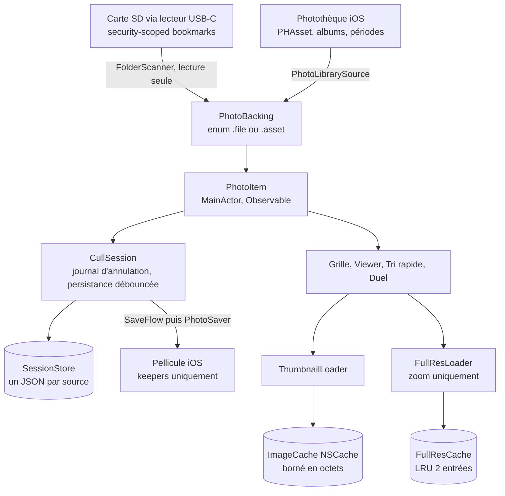
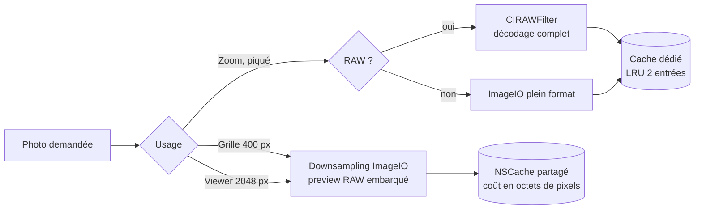
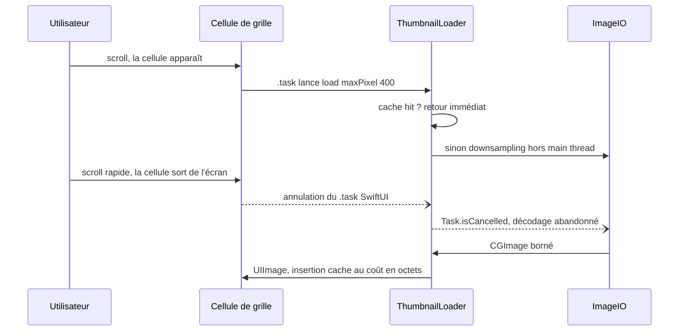
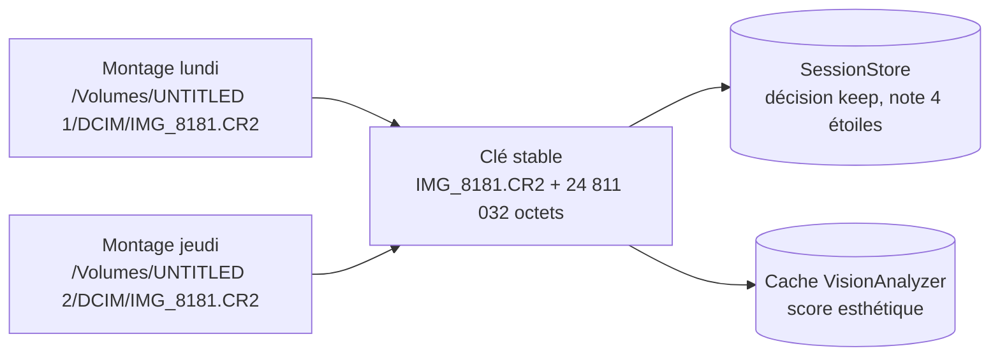

**Contexte**

Quand on branche une carte SD d'appareil photo sur un iPhone USB-C, iOS n'offre aucun vrai workflow de tri : le dialogue d'import natif n'a pas de plein écran navigable, l'app Fichiers gère mal les RAW, et les alternatives (Lightroom, Raw Power) imposent un import préalable ou un abonnement. Peliculle comble ce manque : un viewer plein écran fluide qui travaille directement sur la carte, un tri par gestes (garder / rejeter), et seuls les keepers sont enregistrés dans la pellicule — la carte reste intacte, en lecture seule stricte. Il n'y a pas de version précédente : l'app est une v1 née d'un PRD complet, puis étendue (photothèque et albums comme sources, vidéos, Mode Voyage, suppression confirmée des rejets).

**Stack & Architecture**

- **Swift, strict concurrency `complete`** — tout le pipeline (décodage, indexation EXIF, analyse Vision) est vérifié par le compilateur : acteurs pour les index partagés, état UI isolé au main actor, chaque `Sendable` non trivial justifié en commentaire.
- **SwiftUI + Observation, cible iOS 26** — 100 % natif pour rivaliser avec Photos.app : transition hero grille → viewer (`.navigationTransition(.zoom)`), pagination `TabView` avec l'inertie système, haptique native.
- **ImageIO** — aperçus générés par downsampling borné (`kCGImageSourceThumbnailMaxPixelSize`) : jamais de décodage pleine résolution au scroll ; pour un RAW, ImageIO renvoie le preview JPEG embarqué, quasi instantané.
- **Core Image (`CIRAWFilter`)** — décodage RAW plein format uniquement à la demande (zoom pour vérifier le piqué), routé par type de fichier pour ne jamais construire un pipeline Core Image sur un simple JPEG.
- **PhotoKit** — deuxième famille de sources (photothèque, albums) et écriture des keepers dans la pellicule.
- **Vision** — score esthétique calculé sur l'appareil, en tâche de fond basse priorité, jamais dans le cloud.
- **AVFoundation** — vignettes et lecture des clips vidéo de la carte.
- **Zéro dépendance tierce** — aucun package SPM : ~11 500 lignes de Swift sur les seuls frameworks Apple. Localisation FR/EN par String Catalogs (318 clés), manifeste de confidentialité, tests unitaires sur la logique pure (rafales, tri, persistance, Mode Voyage).

**Architecture globale**

Toute la différence entre les sources tient dans l'enum `PhotoBacking` : le reste de l'app (grille, viewer, tri rapide, filtres, Mode Voyage) manipule des `PhotoItem` sans savoir s'ils viennent d'une carte ou de la photothèque. Une session peut même combiner plusieurs sources, chacune avec sa propre persistance.

**Points techniques notables**

- **Pipeline d'images à trois niveaux, dimensionné pour la RAM d'un iPhone.** Aperçus ~400 px pour la grille et ~2048 px pour le viewer via downsampling ImageIO ; pleine résolution (`CIRAWFilter`) seulement au zoom. Le cache d'aperçus est un `NSCache` borné en octets (un huitième de la RAM physique, plafonné à 300 Mo) ; la pleine résolution a son cache dédié de 2 entrées : un RAW 45 Mpx décodé pèse ~180 Mo de pixels et aurait évincé toute la grille du cache partagé.

- **Annulation coopérative des décodages.** Chaque chargement hérite de l'annulation du `.task` SwiftUI de sa cellule : au scroll rapide, les décodages des cellules sorties de l'écran s'arrêtent au lieu de tourner jusqu'au bout. Une version antérieure en `Task.detached` laissait des centaines de décodages hors écran voler CPU et batterie aux cellules visibles.

- **Identité stable des photos entre deux montages de carte.** L'URL absolue d'une carte SD change à chaque branchement ; la persistance (décisions, notes) et le cache d'analyse sont donc keyés par nom + taille de fichier, jamais par URL. Résultat : débrancher la carte, la rebrancher trois jours plus tard, et reprendre le tri exactement là où il s'était arrêté.

- **Concurrence stricte de bout en bout.** `VisionAnalyzer` et `ExifIndexer` sont des acteurs mutualisés avec déduplication des requêtes en vol (deux cellules demandant la même photo attendent la même tâche), calcul hors acteur en priorité basse, et `allowNetwork: false` pour les passes de fond — analyser 10 000 photos ne doit jamais déclencher 10 000 téléchargements iCloud. À l'inverse, `ImageCache` reste une simple classe `@unchecked Sendable` : `NSCache` est déjà thread-safe, un acteur n'aurait ajouté qu'un saut de contexte par vignette.
- **Le tri comme machine à gestes.** Swipe garder / rejeter / plus tard avec retour haptique, piles de rafales détectées par chaînage temporel (`BurstGrouper`, testé unitairement), duel A/B en tournoi avec zoom synchronisé sur les deux photos (un seul pincement, la même transformation appliquée aux deux panneaux — le moyen le plus fiable de comparer le piqué au même endroit), et journal d'annulation où chaque geste, même en masse, ne fait qu'une entrée.

**Ce que j'ai appris / apporté**

Le plus difficile a été de tenir la promesse d'un ressenti Photos.app sur des RAW de 45 Mpx lus depuis une carte SD : chaque choix du pipeline (niveau de résolution, borne de cache, annulation, clé d'identité) découle d'un problème concret rencontré en usage réel. Le passage à la vérification stricte de concurrence du compilateur Swift m'a forcé à rendre explicite qui possède quel état, et à documenter dans le code pourquoi chaque exception est sûre.
